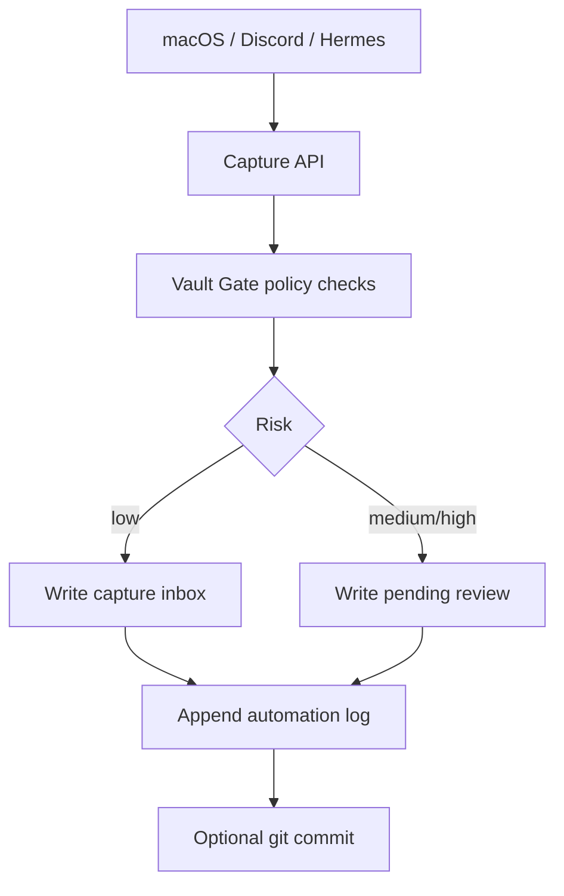

# Vault Gate optional deployment

Vault Gate 是一个可选的知识库写入门禁。它适合把 Obsidian/Markdown vault 放在一台服务器上作为唯一写入端，其它设备通过 API 或 Hermes/Discord 发起写入请求。

它的定位：

- `Leon-knowledgeBase-template` 提供模板、策略示例和部署说明
- `vault_gate.py` 在服务器本地执行真实写入
- Hermes/Discord/macOS Shortcut 只是入口，不能绕过门禁直接改 vault
- Git 负责版本历史，automation log 负责解释每次为什么写入

## Recommended flow



## Files

```text
optional/vault-gate/
  README.md
  policy.example.yaml
  .env.example
  capture-api/
    app.py
    requirements.txt
  curator/
    vault_gate.py
    README.md
  hermes-skill/
    SKILL.md
  launchd/
    com.example.vault-capture-api.plist
    com.example.vault-curator.plist
  tests/
    test_vault_gate.py
```

## Server permissions

If Syncthing is used, the server should be the authoritative writer:

- server vault folder: `sendonly` or `sendreceive`
- other devices: `receiveonly`
- all writes go through Vault Gate API
- reads should go through a read API or a search/index layer, not direct filesystem access from clients

Do not solve this with `chmod`. Syncthing folder type and write ownership are the important parts.

## Quick start

Copy `.env.example` to a private path outside this repo, for example:

```bash
mkdir -p ~/.vault-gate
cp optional/vault-gate/.env.example ~/.vault-gate/vault-gate.env
chmod 600 ~/.vault-gate/vault-gate.env
```

Edit the private env file:

```bash
VAULT_GATE_ROOT=/absolute/path/to/Private-Vault
VAULT_GATE_TOKEN=replace-with-a-long-random-token
VAULT_GATE_AUTHOR="Vault Gate <vault-gate@example.com>"
VAULT_GATE_AUTO_COMMIT=false
```

Run a local capture:

```bash
set -a
. ~/.vault-gate/vault-gate.env
set +a

python3 optional/vault-gate/curator/vault_gate.py capture \
  --source macos \
  --title "Test capture" \
  --body "Hello from Vault Gate" \
  --dry-run
```

Start the API:

```bash
set -a
. ~/.vault-gate/vault-gate.env
set +a

python3 optional/vault-gate/capture-api/app.py --host 127.0.0.1 --port 8787
```

Send a request:

```bash
curl -s http://127.0.0.1:8787/capture \
  -H "Authorization: Bearer $VAULT_GATE_TOKEN" \
  -H "Content-Type: application/json" \
  -d '{"source":"discord","title":"API test","body":"Captured through Vault Gate"}'
```

## Git and logs

Recommended production mode:

- Keep the vault itself as a git repo.
- Let Vault Gate append structured log entries under `99_Meta/automation-log/YYYY-MM.md`.
- Enable auto commit only after dry-runs look correct.

The git commit records the diff. The automation log records the request, source, decision, policy outcome, files touched, and commit hash if one exists.

## Security rules

This folder is safe to commit because it contains only templates and placeholders.

Never commit:

- real API tokens
- Discord bot tokens
- OpenAI/Anthropic keys
- personal vault paths
- private notes
- generated logs from a real vault

Before pushing changes:

```bash
rg -n "token|api[_-]?key|Authorization: Bearer|/Users/|discord" optional/vault-gate
python3 optional/vault-gate/tests/test_vault_gate.py
```

